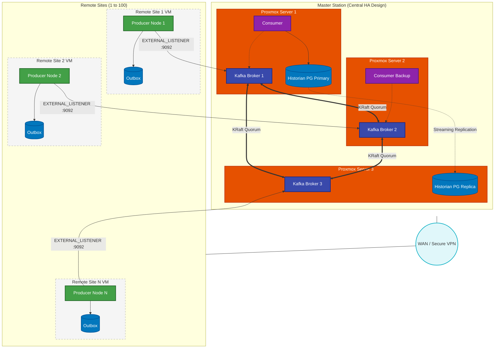

```mermaid
flowchart TD
    %% Styling
    classDef proxmox fill:#E65100,stroke:#BF360C,stroke-width:2px,color:white;
    classDef kafka fill:#3949AB,stroke:#1A237E,stroke-width:2px,color:white;
    classDef postgres fill:#0277BD,stroke:#01579B,stroke-width:2px,color:white;
    classDef producer fill:#43A047,stroke:#1B5E20,stroke-width:2px,color:white;
    classDef consumer fill:#8E24AA,stroke:#4A148C,stroke-width:2px,color:white;
    classDef network fill:#f5f5f5,stroke:#9e9e9e,stroke-width:1px,stroke-dasharray: 5 5;
    classDef wan fill:#E0F7FA,stroke:#00ACC1,stroke-width:2px;

    subgraph MasterZone["Master Station (Central HA Design)"]
        direction LR
        
        subgraph P1["Proxmox Server 1"]
            K1[Kafka Broker 1]:::kafka
            C1[Consumer]:::consumer
            HDB1[(Historian PG Primary)]:::postgres
            C1 --> HDB1
            C1 -.-> K1
        end

        subgraph P2["Proxmox Server 2"]
            K2[Kafka Broker 2]:::kafka
            C2[Consumer Backup]:::consumer
            C2 -.-> K2
        end
        
        subgraph P3["Proxmox Server 3"]
            K3[Kafka Broker 3]:::kafka
            HDB2[(Historian PG Replica)]:::postgres
        end

        %% KRaft Quorum
        K1 <==>|KRaft Quorum| K2
        K2 <==>|KRaft Quorum| K3
        K3 <==>|KRaft Quorum| K1
        
        %% PG Replication
        HDB1 -.->|Streaming Replication| HDB2
    end
    
    WAN((WAN / Secure VPN)):::wan

    subgraph RemoteZones["Remote Sites (1 to 100)"]
        direction LR
        
        subgraph Site1["Remote Site 1 VM"]
            direction TB
            Prod1[Producer Node 1]:::producer
            Out1[(Outbox)]:::postgres
            Prod1 --> Out1
        end

        subgraph Site2["Remote Site 2 VM"]
            direction TB
            Prod2[Producer Node 2]:::producer
            Out2[(Outbox)]:::postgres
            Prod2 --> Out2
        end
        
        subgraph SiteN["Remote Site N VM"]
            direction TB
            ProdN[Producer Node N]:::producer
            OutN[(Outbox)]:::postgres
            ProdN --> OutN
        end
    end

    %% Connections
    MasterZone --- WAN
    WAN --- RemoteZones
    
    %% Semantic flow
    Prod1 -->|EXTERNAL_LISTENER :9092| K1
    Prod2 -->|EXTERNAL_LISTENER :9092| K2
    ProdN -->|EXTERNAL_LISTENER :9092| K3

    class P1,P2,P3 proxmox;
    class Site1,Site2,SiteN network;
```
